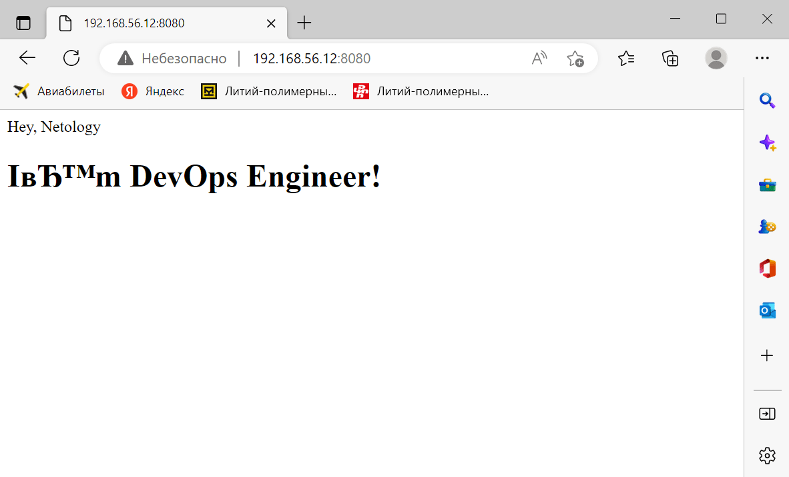

# Домашнее задание к занятию "3. Введение. Экосистема. Архитектура. Жизненный цикл Docker контейнера"


## Задача 1

Сценарий выполения задачи:

- создайте свой репозиторий на https://hub.docker.com;
- выберете любой образ, который содержит веб-сервер Nginx;
- создайте свой fork образа;
- реализуйте функциональность:
запуск веб-сервера в фоне с индекс-страницей, содержащей HTML-код ниже:
```
<html>
<head>
Hey, Netology
</head>
<body>
<h1>I’m DevOps Engineer!</h1>
</body>
</html>
```
Опубликуйте созданный форк в своем репозитории и предоставьте ответ в виде ссылки на https://hub.docker.com/username_repo.

Dockerfile
```
FROM nginx:latest
COPY ./index.html /usr/share/nginx/html/index.html
```

Запускаем сборку образа и контейнер с ним
```
root@docker:/home/vagrant# docker build -t dimitsuri/nginx .
Sending build context to Docker daemon  35.84kB
Step 1/2 : FROM nginx:latest
 ---> 1403e55ab369
Step 2/2 : COPY ./index.html /usr/share/nginx/html/index.html
 ---> 70101fe1e04b
Successfully built 70101fe1e04b
Successfully tagged dimitsuri/nginx:latest
root@docker:/home/vagrant# docker run -it -d -p 8080:80 --name nginx dimitsuri/nginx
dd0d7d18d76cf581835fc94a16e12d9bffd74bbe28ecf9673748bc066632f468
root@docker:/home/vagrant# docker ps
CONTAINER ID   IMAGE             COMMAND                  CREATED          STATUS          PORTS
           NAMES
dd0d7d18d76c   dimitsuri/nginx   "/docker-entrypoint.…"   18 seconds ago   Up 18 seconds   0.0.0.0:8080->80/tcp, :::8080->80/tcp   nginx
root@docker:/home/vagrant# docker images
REPOSITORY        TAG       IMAGE ID       CREATED              SIZE
dimitsuri/nginx   latest    70101fe1e04b   About a minute ago   142MB
nginx             latest    1403e55ab369   13 days ago          142MB
```


Присваим тег образу и отправляем в репозиторий DockerHub
```
root@docker:/home/vagrant# docker tag 70101fe1e04b dimitsuri/nginx:1.0
root@docker:/home/vagrant# docker images
REPOSITORY        TAG       IMAGE ID       CREATED         SIZE
dimitsuri/nginx   1.0       70101fe1e04b   3 minutes ago   142MB
dimitsuri/nginx   latest    70101fe1e04b   3 minutes ago   142MB
nginx             latest    1403e55ab369   13 days ago     142MB
root@docker:/home/vagrant# docker login -u dimitsuri
Password:
WARNING! Your password will be stored unencrypted in /root/.docker/config.json.
Configure a credential helper to remove this warning. See
https://docs.docker.com/engine/reference/commandline/login/#credentials-store

Login Succeeded
root@docker:/home/vagrant# docker push dimitsuri/nginx:1.0
The push refers to repository [docker.io/dimitsuri/nginx]
68ecc7694ac5: Pushed
c72d75f45e5b: Pushed
9a0ef04f57f5: Pushed
d13aea24d2cb: Pushed
2b3eec357807: Pushed
2dadbc36c170: Pushed
8a70d251b653: Pushed
1.0: digest: sha256:6d2d7bfd209706f7dd72fb5d0205f1307f187cbcaa4d3c230318a86b44277443 size: 1777
```
https://hub.docker.com/r/dimitsuri/nginx
## Задача 2

Посмотрите на сценарий ниже и ответьте на вопрос:
"Подходит ли в этом сценарии использование Docker контейнеров или лучше подойдет виртуальная машина, физическая машина? Может быть возможны разные варианты?"

Детально опишите и обоснуйте свой выбор.

--

Сценарий:

- **Высоконагруженное монолитное java веб-приложение** - скорее всего физический сервер, так как требуется много ресурсов, но возможно сойдет и ВМ;
- **Nodejs веб-приложение** - контейнеры, т.к. обычно "скромные" приложения, раскроются преимущества контейнеризации;
- **Мобильное приложение c версиями для Android и iOS** - под андройд - Docker, под iOS - физический или виртуальный Mac, т.к. разработка ведется в MacOS;
- **Шина данных на базе Apache Kafka** - скорее всего Docker подойдет;
- **Elasticsearch кластер для реализации логирования продуктивного веб-приложения** - три ноды elasticsearch, два logstash и две ноды kibana - скорее всего Docker подойдет;
- **Мониторинг-стек на базе Prometheus и Grafana** - скорее всего Docker подойдет;
- **MongoDB, как основное хранилище данных для java-приложения** - физический сервер или ВМ в зависимости от нагрузки;
- **Gitlab сервер для реализации CI/CD процессов и приватный (закрытый) Docker Registry** - скорее ВМ, врятли для пары программистов будут разворачивать standalone сервера, а если команда разработки относительно большая, то на ВМ (или даже физическом сервере) эти сервисы будут работать адекватнее.

## Задача 3

- Запустите первый контейнер из образа ***centos*** c любым тэгом в фоновом режиме, подключив папку ```/data``` из текущей рабочей директории на хостовой машине в ```/data``` контейнера;
- Запустите второй контейнер из образа ***debian*** в фоновом режиме, подключив папку ```/data``` из текущей рабочей директории на хостовой машине в ```/data``` контейнера;
- Подключитесь к первому контейнеру с помощью ```docker exec``` и создайте текстовый файл любого содержания в ```/data```;
- Добавьте еще один файл в папку ```/data``` на хостовой машине;
- Подключитесь во второй контейнер и отобразите листинг и содержание файлов в ```/data``` контейнера.
```
root@docker:/home/vagrant# docker run -it -d -v /data:/data --name centos centos
Unable to find image 'centos:latest' locally
latest: Pulling from library/centos
a1d0c7532777: Pull complete
Digest: sha256:a27fd8080b517143cbbbab9dfb7c8571c40d67d534bbdee55bd6c473f432b177
Status: Downloaded newer image for centos:latest
f304418434fddc0be6c8159d4bb2a7cca377186789e892d89f0f3e2b003abc55
root@docker:/home/vagrant# docker run -it -d -v /data:/data --name debian debian
Unable to find image 'debian:latest' locally
latest: Pulling from library/debian
32de3c850997: Pull complete
Digest: sha256:c66c0e5dc607baefefda1d9e64a3b3a317e4189c540c8eac0c1a06186fe353a1
Status: Downloaded newer image for debian:latest
f18974676497fa38f884a114cda9dbf4ec9674af61154e7c8f31d931e4f2f5de
root@docker:/home/vagrant# docker exec -it centos bash
[root@f304418434fd /]# touch /data/txt_centos.txt
[root@f304418434fd /]# exit
exit
root@docker:/home/vagrant# sudo touch /data/txt_host.txt
root@docker:/home/vagrant# docker exec -it debian bash
root@f18974676497:/# ls /data
txt_centos.txt  txt_host.txt
root@f18974676497:/# exit
exit
```
## Задача 4 (*)

Воспроизвести практическую часть лекции самостоятельно.

Соберите Docker образ с Ansible, загрузите на Docker Hub и пришлите ссылку вместе с остальными ответами к задачам.


