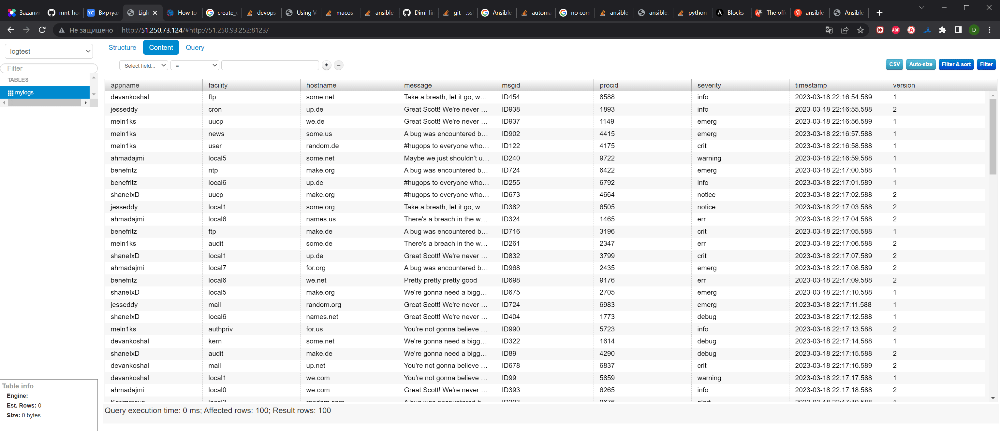

# Домашнее задание к занятию 3 «Использование Yandex Cloud»

## Подготовка к выполнению

1. Подготовьте в Yandex Cloud три хоста: для `clickhouse`, для `vector` и для `lighthouse`.
2. Репозиторий LightHouse находится [по ссылке](https://github.com/VKCOM/lighthouse).

```bash
vagrant@docker:~/playbook$ yc compute instance list
+----------------------+---------------+---------------+---------+---------------+---------------+
|          ID          |     NAME      |    ZONE ID    | STATUS  |  EXTERNAL IP  |  INTERNAL IP  |
+----------------------+---------------+---------------+---------+---------------+---------------+
| fhmnni7g28hhnrbnnbfk | lighthouse-01 | ru-central1-a | RUNNING | 51.250.73.124 | 192.168.56.35 |
| fhmtc1bemk60l7qj0spf | vector-01     | ru-central1-a | RUNNING | 62.84.125.4   | 192.168.56.29 |
| fhmufe2u62respqlgauu | clickhouse-01 | ru-central1-a | RUNNING | 51.250.93.252 | 192.168.56.30 |
+----------------------+---------------+---------------+---------+---------------+---------------+
```
## Основная часть

1. Допишите playbook: нужно сделать ещё один play, который устанавливает и настраивает LightHouse.
2. При создании tasks рекомендую использовать модули: `get_url`, `template`, `yum`, `apt`.
3. Tasks должны: скачать статику LightHouse, установить Nginx или любой другой веб-сервер, настроить его конфиг для открытия LightHouse, запустить веб-сервер.
4. Подготовьте свой inventory-файл `prod.yml`.
5. Запустите `ansible-lint site.yml` и исправьте ошибки, если они есть.
6. Попробуйте запустить playbook на этом окружении с флагом `--check`.
7. Запустите playbook на `prod.yml` окружении с флагом `--diff`. Убедитесь, что изменения на системе произведены.
8. Повторно запустите playbook с флагом `--diff` и убедитесь, что playbook идемпотентен.
9. Подготовьте README.md-файл по своему playbook. В нём должно быть описано: что делает playbook, какие у него есть параметры и теги.
10. Готовый playbook выложите в свой репозиторий, поставьте тег `08-ansible-03-yandex` на фиксирующий коммит, в ответ предоставьте ссылку на него.

```bash
vagrant@docker:~/playbook$ ansible-playbook site.yml --check
[WARNING]: provided hosts list is empty, only localhost is available. Note that the implicit localhost does
not match 'all'
[WARNING]: Could not match supplied host pattern, ignoring: clickhouse

PLAY [Install Clickhouse] *************************************************************************************
skipping: no hosts matched
[WARNING]: Could not match supplied host pattern, ignoring: vector

PLAY [Install Vector] *****************************************************************************************
skipping: no hosts matched
[WARNING]: Could not match supplied host pattern, ignoring: lighthouse

PLAY [Install Lighthouse] *************************************************************************************
skipping: no hosts matched

PLAY RECAP ****************************************************************************************************
```

```bash
vagrant@docker:~/playbook$ ansible-playbook -i inventory/prod.yml site.yml --diff

PLAY [Install Clickhouse] *************************************************************************************

TASK [Gathering Facts] ****************************************************************************************
The authenticity of host '51.250.93.252 (51.250.93.252)' can't be established.
ECDSA key fingerprint is SHA256:NuOmcdCAHbvQxuggLkCwfEDD9z0HI/4F3pMUamCQe/E.
Are you sure you want to continue connecting (yes/no/[fingerprint])? yes
ok: [clickhouse-01]

TASK [Get clickhouse distrib] *********************************************************************************
changed: [clickhouse-01] => (item=clickhouse-client)
changed: [clickhouse-01] => (item=clickhouse-server)
failed: [clickhouse-01] (item=clickhouse-common-static) => {"ansible_loop_var": "item", "changed": false, "dest": "./clickhouse-common-static-22.3.3.44.rpm", "elapsed": 0, "item": "clickhouse-common-static", "msg": "Request failed", "response": "HTTP Error 404: Not Found", "status_code": 404, "url": "https://packages.clickhouse.com/rpm/stable/clickhouse-common-static-22.3.3.44.noarch.rpm"}

TASK [Get clickhouse distrib] *********************************************************************************
changed: [clickhouse-01]

TASK [Install clickhouse packages] ****************************************************************************
changed: [clickhouse-01]

TASK [Enable remote connections to clickhouse server] *********************************************************
--- before: /etc/clickhouse-server/config.xml (content)
+++ after: /etc/clickhouse-server/config.xml (content)
@@ -176,7 +176,7 @@
          - users without password have readonly access.
          See also: https://www.shodan.io/search?query=clickhouse
       -->
-    <!-- <listen_host>::</listen_host> -->
+<listen_host>::</listen_host>


     <!-- Same for hosts without support for IPv6: -->

changed: [clickhouse-01]

RUNNING HANDLER [Start clickhouse service] ********************************************************************
changed: [clickhouse-01]

TASK [Create database] ****************************************************************************************
changed: [clickhouse-01]

TASK [Create log table] ***************************************************************************************
changed: [clickhouse-01]

PLAY [Install Vector] *****************************************************************************************

TASK [Gathering Facts] ****************************************************************************************
The authenticity of host '62.84.125.4 (62.84.125.4)' can't be established.
ECDSA key fingerprint is SHA256:GgSlIg1n3TFb0yka0MXP49iOT0wGVhp3QpjBklriR84.
Are you sure you want to continue connecting (yes/no/[fingerprint])? yes
ok: [vector-01]

TASK [Add clickhouse addresses to /etc/hosts] *****************************************************************
--- before: /etc/hosts (content)
+++ after: /etc/hosts (content)
@@ -1,3 +1,4 @@
 127.0.0.1   localhost localhost.localdomain localhost4 localhost4.localdomain4
 ::1         localhost localhost.localdomain localhost6 localhost6.localdomain6

+51.250.93.252 clickhouse-01

changed: [vector-01] => (item=clickhouse-01)

TASK [Get vector distrib] *************************************************************************************
changed: [vector-01]

TASK [Install vector package] *********************************************************************************
changed: [vector-01]

TASK [Vector config] ******************************************************************************************
--- before
+++ after: /home/vagrant/.ansible/tmp/ansible-local-3849fp90lta1/tmp198oxxdl/vector.yml.j2
@@ -0,0 +1,27 @@
+api:
+    address: 0.0.0.0:8686
+    enabled: true
+sinks:
+    to_clickhouse:
+        compression: gzip
+        database: logtest
+        endpoint: http://51.250.93.252:8123
+        inputs:
+        - parse_logs
+        table: mylogs
+        type: clickhouse
+sources:
+    dummy_logs:
+        format: syslog
+        interval: 1
+        type: demo_logs
+transforms:
+    parse_logs:
+        inputs:
+        - dummy_logs
+        source: '. = parse_syslog!(string!(.message))
+
+            .timestamp = to_string(.timestamp)
+
+            .timestamp = slice!(.timestamp, start:0, end: -1)'
+        type: remap

[WARNING]: The value 1000 (type int) in a string field was converted to u'1000' (type string). If this does
not look like what you expect, quote the entire value to ensure it does not change.
changed: [vector-01]

TASK [Change systemd unit] ************************************************************************************
--- before: /usr/lib/systemd/system/vector.service
+++ after: /home/vagrant/.ansible/tmp/ansible-local-3849fp90lta1/tmp6tso_jty/vector.service.j2
@@ -5,15 +5,10 @@
 Requires=network-online.target

 [Service]
-User=vector
-Group=vector
-ExecStartPre=/usr/bin/vector validate
-ExecStart=/usr/bin/vector
-ExecReload=/usr/bin/vector validate
+User=vagrant
+Group=vagrant
+ExecStart=/usr/bin/vector --config /etc/vector/vector.yml
 ExecReload=/bin/kill -HUP $MAINPID
-Restart=no
-AmbientCapabilities=CAP_NET_BIND_SERVICE
-EnvironmentFile=-/etc/default/vector
-
+Restart=always
 [Install]
 WantedBy=multi-user.target

changed: [vector-01]

RUNNING HANDLER [Start Vector service] ************************************************************************
changed: [vector-01]

PLAY [Install Lighthouse] *************************************************************************************

TASK [Gathering Facts] ****************************************************************************************
The authenticity of host '51.250.73.124 (51.250.73.124)' can't be established.
ECDSA key fingerprint is SHA256:ykjtnf/mBBAjo+Sk627M7TNuMLfzSM9Ja/P3nO1OC8I.
Are you sure you want to continue connecting (yes/no/[fingerprint])? yes
ok: [lighthouse-01]

TASK [Add clickhouse addresses to /etc/hosts] *****************************************************************
--- before: /etc/hosts (content)
+++ after: /etc/hosts (content)
@@ -1,3 +1,4 @@
 127.0.0.1   localhost localhost.localdomain localhost4 localhost4.localdomain4
 ::1         localhost localhost.localdomain localhost6 localhost6.localdomain6

+51.250.93.252 clickhouse-01

changed: [lighthouse-01] => (item=clickhouse-01)

TASK [Install required packages] ******************************************************************************
changed: [lighthouse-01]

TASK [Install nginx] ******************************************************************************************
changed: [lighthouse-01]

TASK [Get lighthouse distrib] *********************************************************************************
changed: [lighthouse-01]

TASK [Unpack lighthouse archive] ******************************************************************************
>d++++++.?? lighthouse-master/
>f++++++.?? lighthouse-master/LICENSE
>f++++++.?? lighthouse-master/README.md
>f++++++.?? lighthouse-master/app.js
* * *
>f++++++.?? lighthouse-master/js/ag-grid.min.js
>f++++++.?? lighthouse-master/js/bootstrap.js
>f++++++.?? lighthouse-master/js/bootstrap.min.js
changed: [lighthouse-01]

TASK [Nginx configuration] ************************************************************************************
--- before
+++ after: /home/vagrant/.ansible/tmp/ansible-local-3849fp90lta1/tmpw4n3bgau
@@ -0,0 +1,14 @@
+server {
+    listen       80;
+    listen       [::]:80;
+    server_name  _;
+    root         /usr/share/nginx/lighthouse-master/;
+    index index.html;
+    include /etc/nginx/default.d/*.conf;
+    error_page 404 /404.html;
+    location = /404.html {
+    }
+    error_page 500 502 503 504 /50x.html;
+    location = /50x.html {
+    }
+}

changed: [lighthouse-01]

RUNNING HANDLER [Start nginx service] *************************************************************************
changed: [lighthouse-01]

PLAY RECAP ****************************************************************************************************
clickhouse-01              : ok=7    changed=6    unreachable=0    failed=0    skipped=0    rescued=1    ignored=0
lighthouse-01              : ok=8    changed=7    unreachable=0    failed=0    skipped=0    rescued=0    ignored=0
vector-01                  : ok=7    changed=6    unreachable=0    failed=0    skipped=0    rescued=0    ignored=0
```

```bash
vagrant@docker:~/playbook$ ansible-playbook -i inventory/prod.yml site.yml --diff

PLAY [Install Clickhouse] *************************************************************************************

TASK [Gathering Facts] ****************************************************************************************
ok: [clickhouse-01]

TASK [Get clickhouse distrib] *********************************************************************************
ok: [clickhouse-01] => (item=clickhouse-client)
ok: [clickhouse-01] => (item=clickhouse-server)
failed: [clickhouse-01] (item=clickhouse-common-static) => {"ansible_loop_var": "item", "changed": false, "dest": "./clickhouse-common-static-22.3.3.44.rpm", "elapsed": 0, "gid": 1000, "group": "vagrant", "item": "clickhouse-common-static", "mode": "0664", "msg": "Request failed", "owner": "vagrant", "response": "HTTP Error 404: Not Found", "secontext": "unconfined_u:object_r:user_home_t:s0", "size": 246310036, "state": "file", "status_code": 404, "uid": 1000, "url": "https://packages.clickhouse.com/rpm/stable/clickhouse-common-static-22.3.3.44.noarch.rpm"}

TASK [Get clickhouse distrib] *********************************************************************************
ok: [clickhouse-01]

TASK [Install clickhouse packages] ****************************************************************************
ok: [clickhouse-01]

TASK [Enable remote connections to clickhouse server] *********************************************************
ok: [clickhouse-01]

TASK [Create database] ****************************************************************************************
ok: [clickhouse-01]

TASK [Create log table] ***************************************************************************************
ok: [clickhouse-01]

PLAY [Install Vector] *****************************************************************************************

TASK [Gathering Facts] ****************************************************************************************
ok: [vector-01]

TASK [Add clickhouse addresses to /etc/hosts] *****************************************************************
ok: [vector-01] => (item=clickhouse-01)

TASK [Get vector distrib] *************************************************************************************
ok: [vector-01]

TASK [Install vector package] *********************************************************************************
ok: [vector-01]

TASK [Vector config] ******************************************************************************************
[WARNING]: The value 1000 (type int) in a string field was converted to u'1000' (type string). If this does
not look like what you expect, quote the entire value to ensure it does not change.
ok: [vector-01]

TASK [Change systemd unit] ************************************************************************************
ok: [vector-01]

PLAY [Install Lighthouse] *************************************************************************************

TASK [Gathering Facts] ****************************************************************************************
ok: [lighthouse-01]

TASK [Add clickhouse addresses to /etc/hosts] *****************************************************************
ok: [lighthouse-01] => (item=clickhouse-01)

TASK [Install required packages] ******************************************************************************
ok: [lighthouse-01]

TASK [Install nginx] ******************************************************************************************
ok: [lighthouse-01]

TASK [Get lighthouse distrib] *********************************************************************************
ok: [lighthouse-01]

TASK [Unpack lighthouse archive] ******************************************************************************
ok: [lighthouse-01]

TASK [Nginx configuration] ************************************************************************************
ok: [lighthouse-01]

PLAY RECAP ****************************************************************************************************
clickhouse-01              : ok=6    changed=0    unreachable=0    failed=0    skipped=0    rescued=1    ignored=0
lighthouse-01              : ok=7    changed=0    unreachable=0    failed=0    skipped=0    rescued=0    ignored=0
vector-01                  : ok=6    changed=0    unreachable=0    failed=0    skipped=0    rescued=0    ignored=0
```


[README.md](https://github.com/Dimi-link/playbook/blob/main/08-ansible-03-yandex/README.md)

[tag 08-ansible-03-yandex](https://github.com/Dimi-link/playbook/releases/tag/08-ansible-03-yandex)

