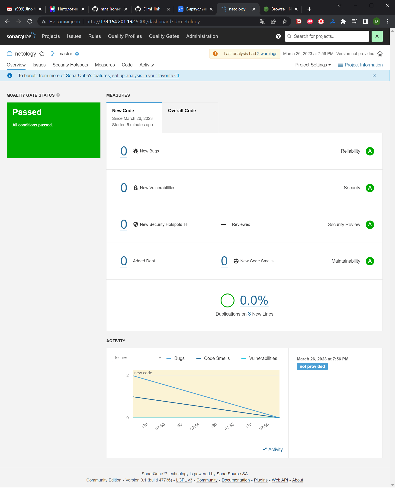

# Домашнее задание к занятию 9 «Процессы CI/CD»

## Подготовка к выполнению

1. Создайте два VM в Yandex Cloud с параметрами: 2CPU 4RAM Centos7 (остальное по минимальным требованиям).
2. Пропишите в [inventory](./infrastructure/inventory/cicd/hosts.yml) [playbook](./infrastructure/site.yml) созданные хосты.
3. Добавьте в [files](./infrastructure/files/) файл со своим публичным ключом (id_rsa.pub). Если ключ называется иначе — найдите таску в плейбуке, которая использует id_rsa.pub имя, и исправьте на своё.
4. Запустите playbook, ожидайте успешного завершения.
5. Проверьте готовность SonarQube через [браузер](http://localhost:9000).
6. Зайдите под admin\admin, поменяйте пароль на свой.
7.  Проверьте готовность Nexus через [бразуер](http://localhost:8081).
8. Подключитесь под admin\admin123, поменяйте пароль, сохраните анонимный доступ.

```bash
vagrant@docker:~$ yc compute instance list
+----------------------+----------+---------------+---------+-----------------+---------------+
|          ID          |   NAME   |    ZONE ID    | STATUS  |   EXTERNAL IP   |  INTERNAL IP  |
+----------------------+----------+---------------+---------+-----------------+---------------+
| fhm9l0unm5dfgtllr1df | sonar-01 | ru-central1-a | RUNNING | 178.154.201.192 | 192.168.56.24 |
| fhmvktari2edld9pg6vv | nexus-01 | ru-central1-a | RUNNING | 178.154.200.110 | 192.168.56.27 |
+----------------------+----------+---------------+---------+-----------------+---------------+
```
## Знакомоство с SonarQube

### Основная часть

1. Создайте новый проект, название произвольное.
2. Скачайте пакет sonar-scanner, который вам предлагает скачать SonarQube.
3. Сделайте так, чтобы binary был доступен через вызов в shell (или поменяйте переменную PATH, или любой другой, удобный вам способ).
4. Проверьте `sonar-scanner --version`.
5. Запустите анализатор против кода из директории [example](./example) с дополнительным ключом `-Dsonar.coverage.exclusions=fail.py`.
6. Посмотрите результат в интерфейсе.
7. Исправьте ошибки, которые он выявил, включая warnings.
8. Запустите анализатор повторно — проверьте, что QG пройдены успешно.
9. Сделайте скриншот успешного прохождения анализа, приложите к решению ДЗ.

```bash
vagrant@docker:~$ sonar-scanner -v
INFO: Scanner configuration file: /opt/sonar-scanner/conf/sonar-scanner.properties
INFO: Project root configuration file: NONE
INFO: SonarScanner 4.8.0.2856
INFO: Java 11.0.17 Eclipse Adoptium (64-bit)
INFO: Linux 5.4.0-110-generic amd64
```
[исправленный fail.py](./example/fail.py) 


## Знакомство с Nexus

### Основная часть

1. В репозиторий `maven-public` загрузите артефакт с GAV-параметрами:

 *    groupId: netology;
 *    artifactId: java;
 *    version: 8_282;
 *    classifier: distrib;
 *    type: tar.gz.
   
2. В него же загрузите такой же артефакт, но с version: 8_102.
3. Проверьте, что все файлы загрузились успешно.
4. В ответе пришлите файл `maven-metadata.xml` для этого артефекта.

[maven-metadata.xml](maven-metadata.xml) 
### Знакомство с Maven

### Подготовка к выполнению

1. Скачайте дистрибутив с [maven](https://maven.apache.org/download.cgi).
2. Разархивируйте, сделайте так, чтобы binary был доступен через вызов в shell (или поменяйте переменную PATH, или любой другой, удобный вам способ).
3. Удалите из `apache-maven-<version>/conf/settings.xml` упоминание о правиле, отвергающем HTTP- соединение — раздел mirrors —> id: my-repository-http-unblocker.
4. Проверьте `mvn --version`.
5. Заберите директорию [mvn](./mvn) с pom.

```bash
vagrant@docker:~$ mvn -version
Apache Maven 3.9.1 (2e178502fcdbffc201671fb2537d0cb4b4cc58f8)
Maven home: /opt/apache-maven-3.9.1
Java version: 13.0.1, vendor: Oracle Corporation, runtime: /opt/jdk-13.0.1
Default locale: en_US, platform encoding: ANSI_X3.4-1968
OS name: "linux", version: "5.4.0-110-generic", arch: "amd64", family: "unix"
```
### Основная часть

1. Поменяйте в `pom.xml` блок с зависимостями под ваш артефакт из первого пункта задания для Nexus (java с версией 8_282).
2. Запустите команду `mvn package` в директории с `pom.xml`, ожидайте успешного окончания.
3. Проверьте директорию `~/.m2/repository/`, найдите ваш артефакт.
4. В ответе пришлите исправленный файл `pom.xml`.

```bash
vagrant@docker:~/.m2/repository/netology$ tree
.
`-- java
    `-- 8_282
        |-- _remote.repositories
        |-- java-8_282-distrib.tar.gz
        |-- java-8_282-distrib.tar.gz.sha1
        `-- java-8_282.pom.lastUpdated

2 directories, 4 files
```
[pom.xml](./mvn/pom.xml) 

