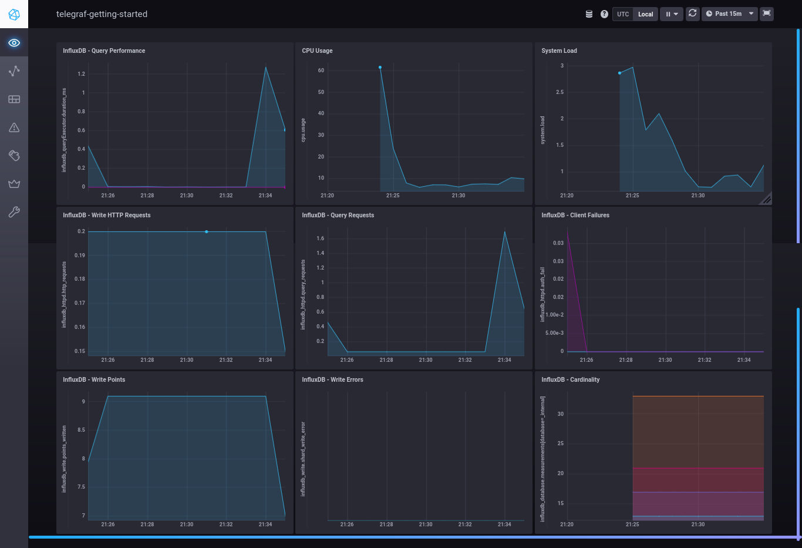
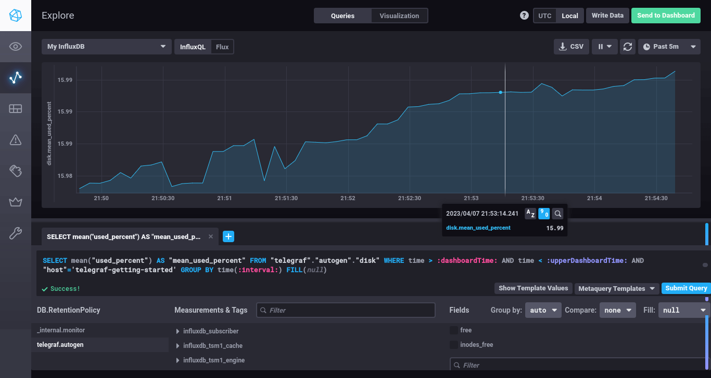
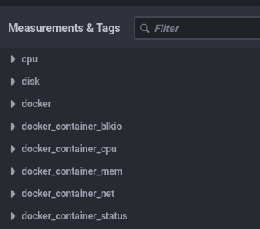

# Домашнее задание к занятию "13.Системы мониторинга"

## Обязательные задания

1. Вас пригласили настроить мониторинг на проект. На онбординге вам рассказали, что проект представляет из себя 
платформу для вычислений с выдачей текстовых отчетов, которые сохраняются на диск. Взаимодействие с платформой 
осуществляется по протоколу http. Также вам отметили, что вычисления загружают ЦПУ. Какой минимальный набор метрик вы
выведите в мониторинг и почему?

- __мониторинг ОС__:
  - процессор: load average
  - память: утилизация
  - диск: объем данных, скорость записи/чтения, количество inodes
  - сеть: загрузка интерфейсов
    
- __мониторинг задействованных сервисов (субд, веб-серверов, файловые хранилища)__:
  - доступность
  - наличие ошибок
  - время отклика
- __мониторинг приложения__:
  - HTTP-запросы: общее количество запросов, количество ошибочных запросов, время выполнения запросов
  - iops: количество операций, время исполнения операций
    


2. Менеджер продукта посмотрев на ваши метрики сказал, что ему непонятно что такое RAM/inodes/CPUla. Также он сказал, 
что хочет понимать, насколько мы выполняем свои обязанности перед клиентами и какое качество обслуживания. Что вы 
можете ему предложить?

_Объяснить, что такое RAM/inodes/CPUla, показать текущие метрики в том числе по доступности системы, процента ошибок._

3. Вашей DevOps команде в этом году не выделили финансирование на построение системы сбора логов. Разработчики в свою 
очередь хотят видеть все ошибки, которые выдают их приложения. Какое решение вы можете предпринять в этой ситуации, 
чтобы разработчики получали ошибки приложения?

- собирать логи с событиями только статусов ERROR/FAILURE
- собирать логи от более ограниченного числа приложений/хостов
- хранить логи минимальный период

4. Вы, как опытный SRE, сделали мониторинг, куда вывели отображения выполнения SLA=99% по http кодам ответов. 
Вычисляете этот параметр по следующей формуле: summ_2xx_requests/summ_all_requests. Данный параметр не поднимается выше 
70%, но при этом в вашей системе нет кодов ответа 5xx и 4xx. Где у вас ошибка?

_не учтены коды ответов 3хх, которые нужно или добавить в числителе или вычесть из знаменателя_

5. Опишите основные плюсы и минусы pull и push систем мониторинга.

__push__:

  __+__:
  - не требует открытия входящих портов на агентах;
  - можно обеспечить высокую сетевую производительность, используя udp;
  - гибкая настройка агентов в части обмена трафиком.

  __-__:
  - полное отсутствие информации о состоянии агента, если он не присылает метрики;
  - сложнее контролировать подлинность данных;

__pull__:

  __+__:
  - есть возможность централизованно выбирать агенты, с которых требуется собирать метрики;
  - простой протокол сбора метрик;

  __-__:
  - требуется дополнительный механизм обновления списка объектов мониторинга (discovery);
  - необходимо открывать входящие порты на объектах мониторинга;
  - плохо ложится на событийную модель сбора метрик, например, для сбора результатов исполнения каких-то разовых задач;


6. Какие из ниже перечисленных систем относятся к push модели, а какие к pull? А может есть гибридные?

    - Prometheus _pull_
    - TICK _push или pull в зависимости от возможностей input-плагина_
    - Zabbix _push или pull_
    - VictoriaMetrics _pull через vmagent, push через remote write_
    - Nagios _в основном pull, push в зависимости от агента_
#
7. Склонируйте себе [репозиторий](https://github.com/influxdata/sandbox/tree/master) и запустите TICK-стэк, 
используя технологии docker и docker-compose.

В виде решения на это упражнение приведите скриншот веб-интерфейса ПО chronograf (`http://localhost:8888`). 

P.S.: если при запуске некоторые контейнеры будут падать с ошибкой - проставьте им режим `Z`, например
`./data:/var/lib:Z`



8. Перейдите в веб-интерфейс Chronograf (`http://localhost:8888`) и откройте вкладку `Data explorer`.

    - Нажмите на кнопку `Add a query`
    - Изучите вывод интерфейса и выберите БД `telegraf.autogen`
    - В `measurments` выберите mem->host->telegraf_container_id , а в `fields` выберите used_percent. 
    Внизу появится график утилизации оперативной памяти в контейнере telegraf.
    - Вверху вы можете увидеть запрос, аналогичный SQL-синтаксису. 
    Поэкспериментируйте с запросом, попробуйте изменить группировку и интервал наблюдений.

Для выполнения задания приведите скриншот с отображением метрик утилизации места на диске 
(disk->host->telegraf_container_id) из веб-интерфейса.



9. Изучите список [telegraf inputs](https://github.com/influxdata/telegraf/tree/master/plugins/inputs). 
Добавьте в конфигурацию telegraf следующий плагин - [docker](https://github.com/influxdata/telegraf/tree/master/plugins/inputs/docker):
```
[[inputs.docker]]
  endpoint = "unix:///var/run/docker.sock"
```

Дополнительно вам может потребоваться донастройка контейнера telegraf в `docker-compose.yml` дополнительного volume и 
режима privileged:
```
  telegraf:
    image: telegraf:1.4.0
    privileged: true
    volumes:
      - ./etc/telegraf.conf:/etc/telegraf/telegraf.conf:Z
      - /var/run/docker.sock:/var/run/docker.sock:Z
    links:
      - influxdb
    ports:
      - "8092:8092/udp"
      - "8094:8094"
      - "8125:8125/udp"
```

После настройке перезапустите telegraf, обновите веб интерфейс и приведите скриншотом список `measurments` в 
веб-интерфейсе базы telegraf.autogen . Там должны появиться метрики, связанные с docker.



Факультативно можете изучить какие метрики собирает telegraf после выполнения данного задания.


