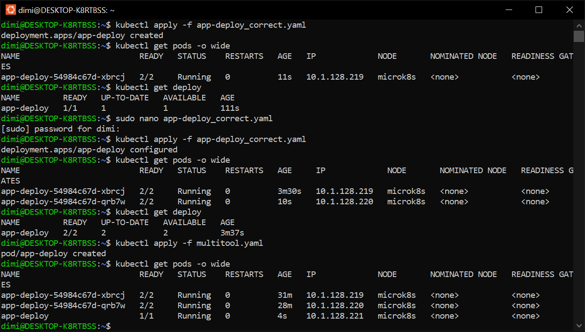
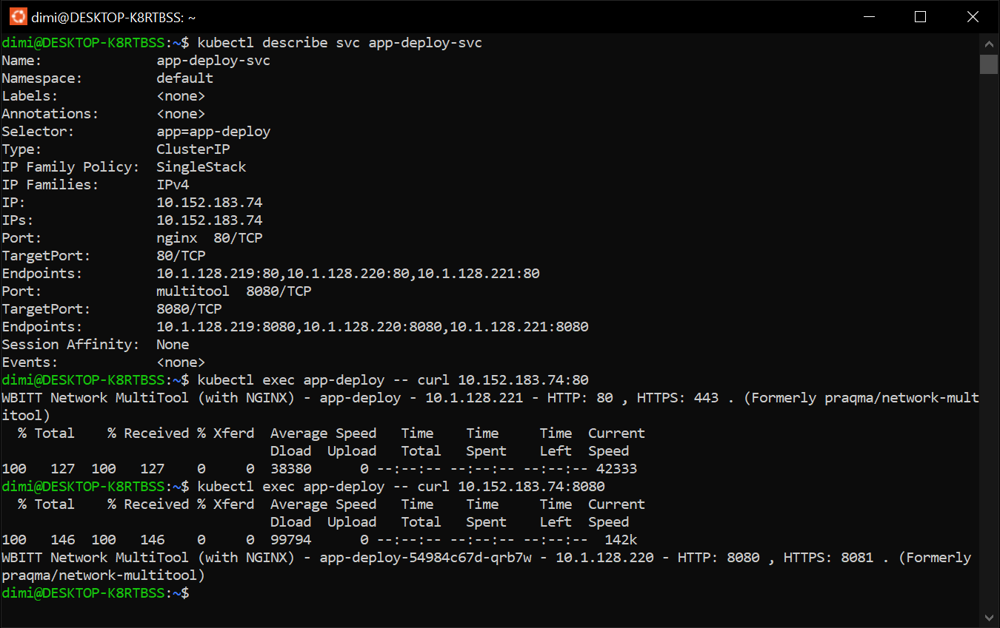
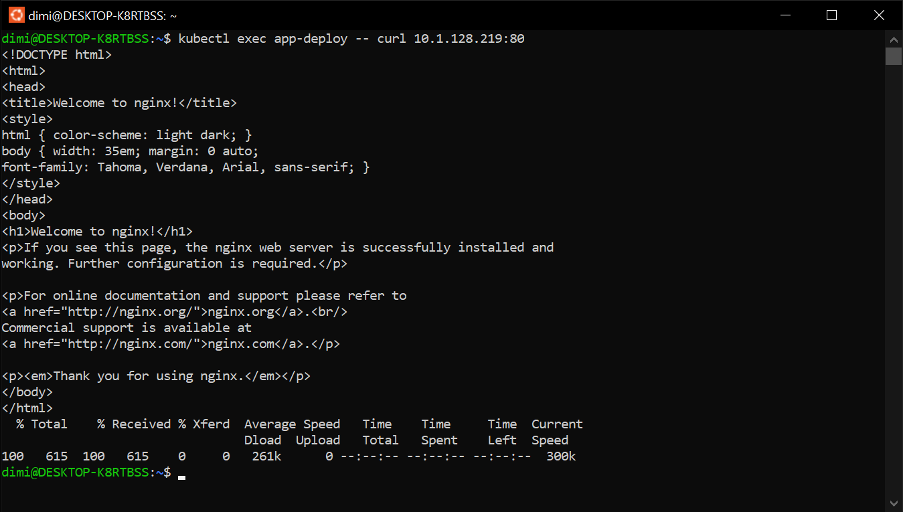
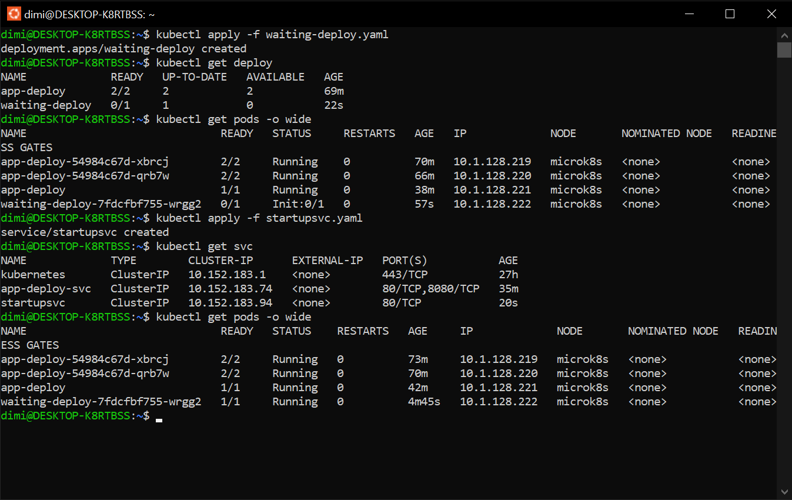

# Домашнее задание к занятию «Запуск приложений в K8S»

### Цель задания

В тестовой среде для работы с Kubernetes, установленной в предыдущем ДЗ, необходимо развернуть Deployment с приложением, состоящим из нескольких контейнеров, и масштабировать его.

------

### Чеклист готовности к домашнему заданию

1. Установленное k8s-решение (например, MicroK8S).
2. Установленный локальный kubectl.
3. Редактор YAML-файлов с подключённым git-репозиторием.

------

### Инструменты и дополнительные материалы, которые пригодятся для выполнения задания

1. [Описание](https://kubernetes.io/docs/concepts/workloads/controllers/deployment/) Deployment и примеры манифестов.
2. [Описание](https://kubernetes.io/docs/concepts/workloads/pods/init-containers/) Init-контейнеров.
3. [Описание](https://github.com/wbitt/Network-MultiTool) Multitool.

------

### Задание 1. Создать Deployment и обеспечить доступ к репликам приложения из другого Pod

1. Создать Deployment приложения, состоящего из двух контейнеров — nginx и multitool. Решить возникшую ошибку.
2. После запуска увеличить количество реплик работающего приложения до 2.
3. Продемонстрировать количество подов до и после масштабирования.
4. Создать Service, который обеспечит доступ до реплик приложений из п.1.
5. Создать отдельный Pod с приложением multitool и убедиться с помощью `curl`, что из пода есть доступ до приложений из п.1.

Запускаем созданный [Deployment](./src/app-deploy.yaml), сталкиваемся с конфликтом портов сервисов, т.к. multitool 
содержит в себе nginx 
```bash
dimi@DESKTOP-K8RTBSS:~$ kubectl apply -f app-deploy.yaml
deployment.apps/app-deploy created
dimi@DESKTOP-K8RTBSS:~$ kubectl get pods -o wide
NAME                         READY   STATUS              RESTARTS   AGE   IP       NODE       NOMINATED NODE   READINESS GATES
app-deploy-9c574c9cb-k92qt   0/2     ContainerCreating   0          8s    <none>   microk8s   <none>           <none>
dimi@DESKTOP-K8RTBSS:~$ kubectl describe pods app-deploy-9c574c9cb-k92qt
Name:             app-deploy-9c574c9cb-k92qt
Namespace:        default
Priority:         0
Service Account:  default
Node:             microk8s/192.168.56.12
Start Time:       Sun, 07 Jan 2024 14:29:38 +0300
Labels:           app=app-deploy
                  pod-template-hash=9c574c9cb
Annotations:      cni.projectcalico.org/containerID: ead354b4bdd83c13d4d289d9538b927352211235a0d6b8831c34f4caa90a5378
                  cni.projectcalico.org/podIP: 10.1.128.218/32
                  cni.projectcalico.org/podIPs: 10.1.128.218/32
Status:           Running
IP:               10.1.128.218
IPs:
  IP:           10.1.128.218
Controlled By:  ReplicaSet/app-deploy-9c574c9cb
Containers:
  nginx:
    Container ID:   containerd://eb3ca960227c6fffa5124ba56cc8cc3e1db4e5ed3da6cc9c8ce78853e92aa838
    Image:          nginx:1.21
    Image ID:       docker.io/library/nginx@sha256:2bcabc23b45489fb0885d69a06ba1d648aeda973fae7bb981bafbb884165e514
    Port:           80/TCP
    Host Port:      0/TCP
    State:          Running
      Started:      Sun, 07 Jan 2024 14:29:51 +0300
    Ready:          True
    Restart Count:  0
    Environment:    <none>
    Mounts:
      /var/run/secrets/kubernetes.io/serviceaccount from kube-api-access-zvnxz (ro)
  multitool:
    Container ID:   containerd://56beb85baab43a1cada3395d7a68b2729f958a6809b14e5ab3db08198e9e23a4
    Image:          wbitt/network-multitool
    Image ID:       docker.io/wbitt/network-multitool@sha256:d1137e87af76ee15cd0b3d4c7e2fcd111ffbd510ccd0af076fc98dddfc50a735
    Port:           8080/TCP
    Host Port:      0/TCP
    State:          Terminated
      Reason:       Error
      Exit Code:    1
      Started:      Sun, 07 Jan 2024 14:30:29 +0300
      Finished:     Sun, 07 Jan 2024 14:30:32 +0300
    Last State:     Terminated
      Reason:       Error
      Exit Code:    1
      Started:      Sun, 07 Jan 2024 14:30:12 +0300
      Finished:     Sun, 07 Jan 2024 14:30:15 +0300
    Ready:          False
    Restart Count:  2
    Environment:    <none>
    Mounts:
      /var/run/secrets/kubernetes.io/serviceaccount from kube-api-access-zvnxz (ro)
Conditions:
  Type              Status
  Initialized       True
  Ready             False
  ContainersReady   False
  PodScheduled      True
Volumes:
  kube-api-access-zvnxz:
    Type:                    Projected (a volume that contains injected data from multiple sources)
    TokenExpirationSeconds:  3607
    ConfigMapName:           kube-root-ca.crt
    ConfigMapOptional:       <nil>
    DownwardAPI:             true
QoS Class:                   BestEffort
Node-Selectors:              <none>
Tolerations:                 node.kubernetes.io/not-ready:NoExecute op=Exists for 300s
                             node.kubernetes.io/unreachable:NoExecute op=Exists for 300s
Events:
  Type     Reason     Age               From               Message
  ----     ------     ----              ----               -------
  Normal   Scheduled  56s               default-scheduler  Successfully assigned default/app-deploy-9c574c9cb-k92qt to microk8s
  Normal   Pulling    55s               kubelet            Pulling image "nginx:1.21"
  Normal   Pulled     43s               kubelet            Successfully pulled image "nginx:1.21" in 12.578s (12.578s including waiting)
  Normal   Created    43s               kubelet            Created container nginx
  Normal   Started    43s               kubelet            Started container nginx
  Normal   Pulling    43s               kubelet            Pulling image "wbitt/network-multitool"
  Normal   Pulled     31s               kubelet            Successfully pulled image "wbitt/network-multitool" in 11.269s (11.269s including waiting)
  Normal   Pulled     5s (x2 over 22s)  kubelet            Container image "wbitt/network-multitool" already present on machine
  Normal   Created    5s (x3 over 31s)  kubelet            Created container multitool
  Normal   Started    5s (x3 over 31s)  kubelet            Started container multitool
  Warning  BackOff    2s (x2 over 19s)  kubelet            Back-off restarting failed container multitool in pod app-deploy-9c574c9cb-k92qt_default(48198468-53c9-412d-8e08-868a1748e412)
dimi@DESKTOP-K8RTBSS:~$
```
Исправляем конфиг и запускаем [исправленный Deployment](./src/app-deploy_correct.yaml) и следуем дальше по заданию





[Pod](./src/multitool.yaml) 

[Service](./src/app-deploy-svc.yaml)

------

### Задание 2. Создать Deployment и обеспечить старт основного контейнера при выполнении условий

1. Создать Deployment приложения nginx и обеспечить старт контейнера только после того, как будет запущен сервис этого приложения.
2. Убедиться, что nginx не стартует. В качестве Init-контейнера взять busybox.
3. Создать и запустить Service. Убедиться, что Init запустился.
4. Продемонстрировать состояние пода до и после запуска сервиса.

[Deployment](./src/waiting-deploy.yaml)

[Service](./src/startupsvc.yaml)



------

### Правила приема работы

1. Домашняя работа оформляется в своем Git-репозитории в файле README.md. Выполненное домашнее задание пришлите ссылкой на .md-файл в вашем репозитории.
2. Файл README.md должен содержать скриншоты вывода необходимых команд `kubectl` и скриншоты результатов.
3. Репозиторий должен содержать файлы манифестов и ссылки на них в файле README.md.

------
