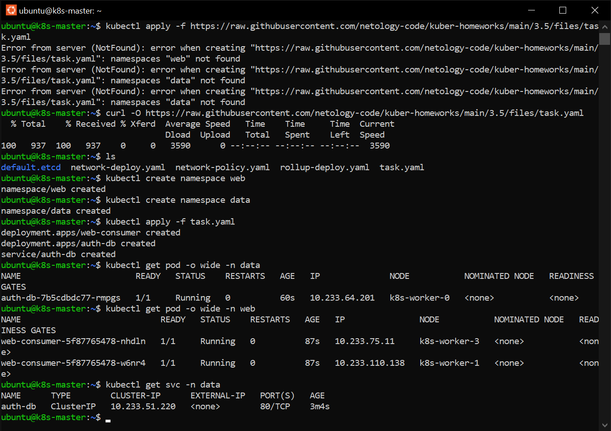

# Домашнее задание к занятию Troubleshooting

### Цель задания

Устранить неисправности при деплое приложения.

### Чеклист готовности к домашнему заданию

1. Кластер K8s.

### Задание. При деплое приложение web-consumer не может подключиться к auth-db. Необходимо это исправить

1. Установить приложение по команде:
```shell
kubectl apply -f https://raw.githubusercontent.com/netology-code/kuber-homeworks/main/3.5/files/task.yaml
```
2. Выявить проблему и описать.
3. Исправить проблему, описать, что сделано.
4. Продемонстрировать, что проблема решена.


При запуске деплоймента отсутствовали неймспейсы web и data. Заодно скачаем приложение, чтобы по мере необходимости 
внести в него правки.


Как и сказано в условии web-consumer не может подключиться к auth-db. Это связано с тем, что поды находяться в 
разных неймспейсах и необходимо использовать полное доменное имя сервиcа (FQDN). В данном деплойменте приложение 
web-consumer обращалось по имени сервиса ```auth-db```, FQDN-имя сервиса ```auth-db.data.svc.cluster.local```.
Исправляем запись в строке 20 деплоймента:
```yaml
        - while true; do curl auth-db; sleep 5; done
```
на
```yaml
        - while true; do curl auth-db.data.svc.cluster.local; sleep 5; done
```

Подключение web-consumer к auth-db восстановлено 

[Deployment](./src/task.yaml)


### Правила приёма работы

1. Домашняя работа оформляется в своём Git-репозитории в файле README.md. Выполненное домашнее задание пришлите ссылкой на .md-файл в вашем репозитории.
2. Файл README.md должен содержать скриншоты вывода необходимых команд, а также скриншоты результатов.
3. Репозиторий должен содержать тексты манифестов или ссылки на них в файле README.md.
