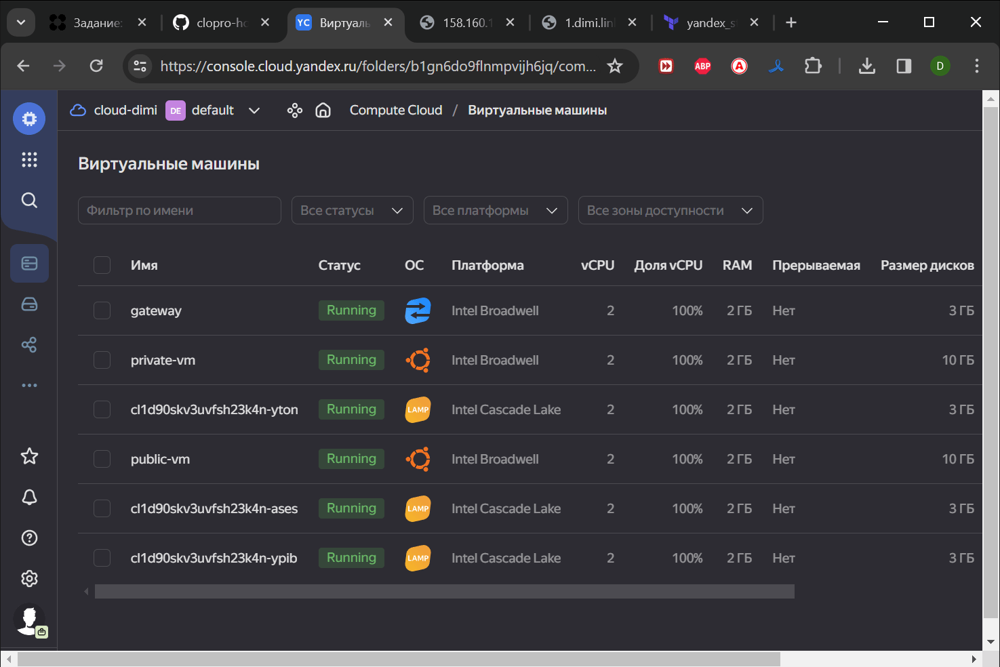
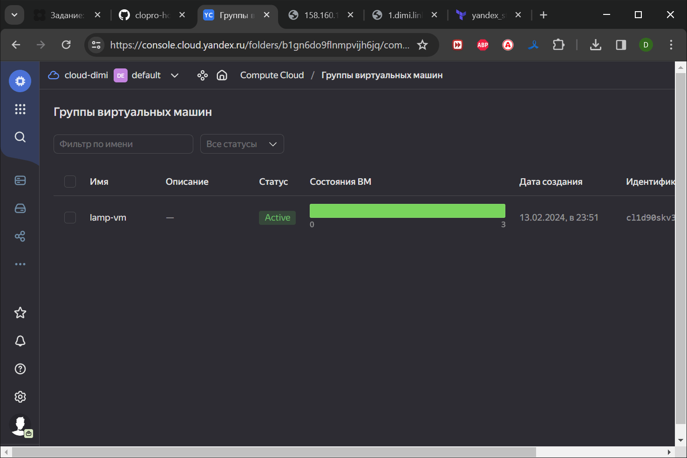
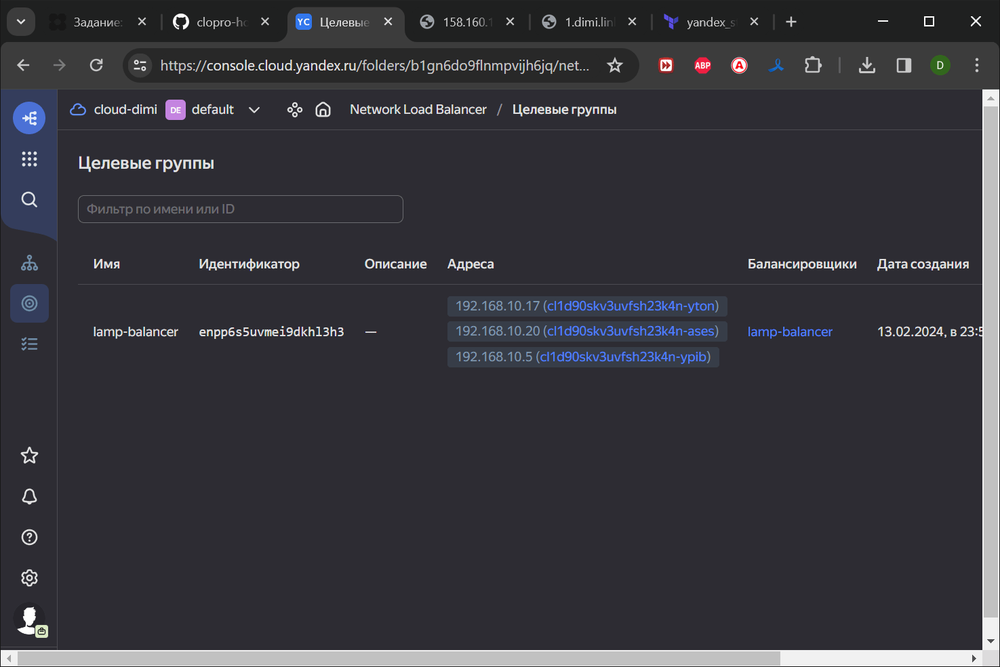
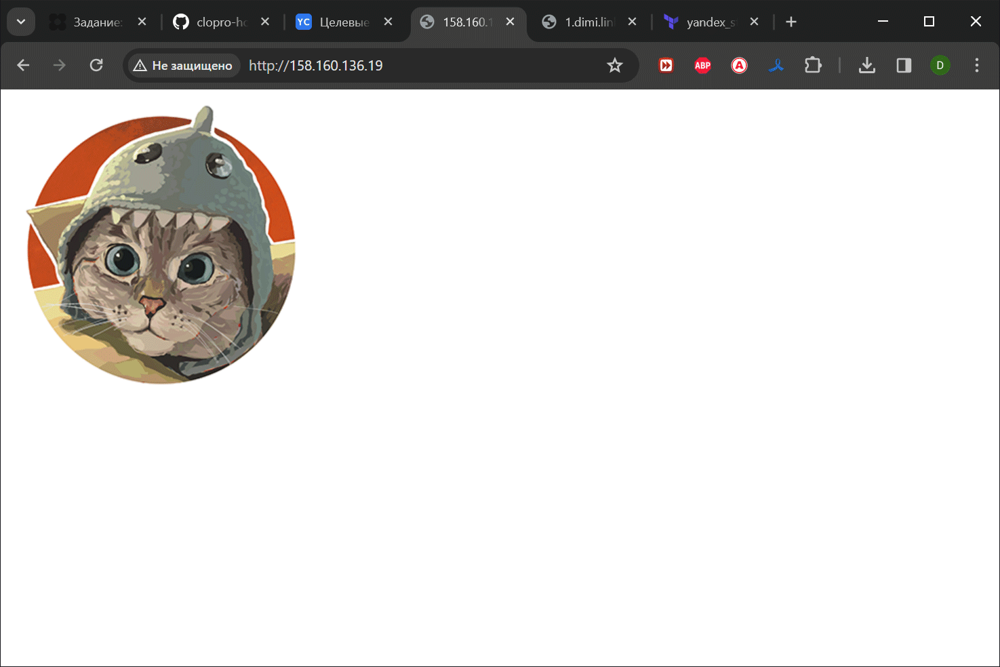
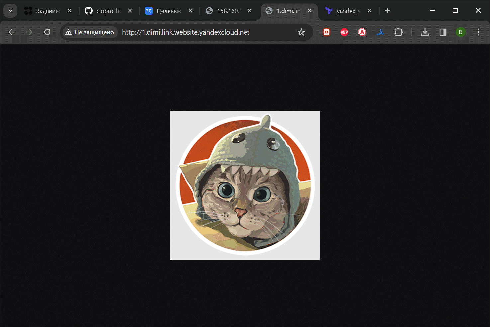

# Домашнее задание к занятию «Вычислительные мощности. Балансировщики нагрузки»  

### Подготовка к выполнению задания

1. Домашнее задание состоит из обязательной части, которую нужно выполнить на провайдере Yandex Cloud, и дополнительной части в AWS (выполняется по желанию). 
2. Все домашние задания в блоке 15 связаны друг с другом и в конце представляют пример законченной инфраструктуры.  
3. Все задания нужно выполнить с помощью Terraform. Результатом выполненного домашнего задания будет код в репозитории. 
4. Перед началом работы настройте доступ к облачным ресурсам из Terraform, используя материалы прошлых лекций и домашних заданий.

---
## Задание 1. Yandex Cloud 

**Что нужно сделать**

1. Создать бакет Object Storage и разместить в нём файл с картинкой:

 - Создать бакет в Object Storage с произвольным именем (например, _имя_студента_дата_).
 - Положить в бакет файл с картинкой.
 - Сделать файл доступным из интернета.
 
2. Создать группу ВМ в public подсети фиксированного размера с шаблоном LAMP и веб-страницей, содержащей ссылку на картинку из бакета:

 - Создать Instance Group с тремя ВМ и шаблоном LAMP. Для LAMP рекомендуется использовать `image_id = fd827b91d99psvq5fjit`.
 - Для создания стартовой веб-страницы рекомендуется использовать раздел `user_data` в [meta_data](https://cloud.yandex.ru/docs/compute/concepts/vm-metadata).
 - Разместить в стартовой веб-странице шаблонной ВМ ссылку на картинку из бакета.
 - Настроить проверку состояния ВМ.
 
3. Подключить группу к сетевому балансировщику:

 - Создать сетевой балансировщик.
 - Проверить работоспособность, удалив одну или несколько ВМ.
4. (дополнительно)* Создать Application Load Balancer с использованием Instance group и проверкой состояния.

Полезные документы:

- [Compute instance group](https://registry.terraform.io/providers/yandex-cloud/yandex/latest/docs/resources/compute_instance_group).
- [Network Load Balancer](https://registry.terraform.io/providers/yandex-cloud/yandex/latest/docs/resources/lb_network_load_balancer).
- [Группа ВМ с сетевым балансировщиком](https://cloud.yandex.ru/docs/compute/operations/instance-groups/create-with-balancer).

Так как конфиг [Terraform](./src/terraform) стал достаточно большим, было принято решение разбить его на модули 
с заделом на добавление Application Load Balancer в последствии.

```bash
Apply complete! Resources: 7 added, 0 changed, 0 destroyed.
dimi@DESKTOP-K8RTBSS:~/terraform/balance$ yc compute instance list
+----------------------+---------------------------+---------------+---------+----------------+----------------+
|          ID          |           NAME            |    ZONE ID    | STATUS  |  EXTERNAL IP   |  INTERNAL IP   |
+----------------------+---------------------------+---------------+---------+----------------+----------------+
| fhm4nkj00ctrnkp4r1j0 | gateway                   | ru-central1-a | RUNNING | 158.160.99.202 | 192.168.10.254 |
| fhm70nr3f0p6bonlbbm0 | private-vm                | ru-central1-a | RUNNING |                | 192.168.20.20  |
| fhm82t9lpo85d0vgh58s | cl1d90skv3uvfsh23k4n-yton | ru-central1-a | RUNNING |                | 192.168.10.17  |
| fhm8i7gh1njg33enq97j | public-vm                 | ru-central1-a | RUNNING | 158.160.124.35 | 192.168.10.29  |
| fhmbeo0qf3fricgjrek7 | cl1d90skv3uvfsh23k4n-ases | ru-central1-a | RUNNING |                | 192.168.10.20  |
| fhmfmjflejquug18fv87 | cl1d90skv3uvfsh23k4n-ypib | ru-central1-a | RUNNING |                | 192.168.10.5   |
+----------------------+---------------------------+---------------+---------+----------------+----------------+

dimi@DESKTOP-K8RTBSS:~/terraform/balance$ yc storage bucket list
+-------------+----------------------+----------+-----------------------+---------------------+
|    NAME     |      FOLDER ID       | MAX SIZE | DEFAULT STORAGE CLASS |     CREATED AT      |
+-------------+----------------------+----------+-----------------------+---------------------+
| 1.dimi.link | b1gn6do9flnmpvijh6jq |        0 | STANDARD              | 2024-02-13 20:51:51 |
+-------------+----------------------+----------+-----------------------+---------------------+

dimi@DESKTOP-K8RTBSS:~/terraform/balance$ yc storage bucket get 1.dimi.link --full
name: 1.dimi.link
folder_id: b1gn6do9flnmpvijh6jq
anonymous_access_flags:
  read: true
  list: true
  config_read: true
default_storage_class: STANDARD
versioning: VERSIONING_DISABLED
acl:
  grants:
    - permission: PERMISSION_READ
      grant_type: GRANT_TYPE_ALL_USERS
created_at: "2024-02-13T20:51:51.657354Z"
website_settings:
  index: index.png
  error: error.html
  redirect_all_requests: {}

dimi@DESKTOP-K8RTBSS:~/terraform/balance$ yc load-balancer network-load-balancer list
+----------------------+---------------+-------------+----------+----------------+------------------------+--------+
|          ID          |     NAME      |  REGION ID  |   TYPE   | LISTENER COUNT | ATTACHED TARGET GROUPS | STATUS |
+----------------------+---------------+-------------+----------+----------------+------------------------+--------+
| enpla86f6ejbrjmm3aji | lamp-balancer | ru-central1 | EXTERNAL |              1 | enpp6s5uvmei9dkhl3h3   | ACTIVE |
+----------------------+---------------+-------------+----------+----------------+------------------------+--------+

dimi@DESKTOP-K8RTBSS:~/terraform/balance$ yc load-balancer network-load-balancer get lamp-balancer
id: enpla86f6ejbrjmm3aji
folder_id: b1gn6do9flnmpvijh6jq
created_at: "2024-02-13T20:53:47Z"
name: lamp-balancer
region_id: ru-central1
status: ACTIVE
type: EXTERNAL
listeners:
  - name: http-listener
    address: 158.160.136.19
    port: "80"
    protocol: TCP
    target_port: "80"
    ip_version: IPV4
attached_target_groups:
  - target_group_id: enpp6s5uvmei9dkhl3h3
    health_checks:
      - name: http
        interval: 2s
        timeout: 1s
        unhealthy_threshold: "2"
        healthy_threshold: "2"
        http_options:
          port: "80"
          path: /

dimi@DESKTOP-K8RTBSS:~/terraform/balance$
```






Удаление одной ВМ не повлияло на доступность изображения. Взамен удаленной развернулась новая ВМ в группе.

```bash
dimi@DESKTOP-K8RTBSS:~/terraform/balance$ yc compute instance list
+----------------------+---------------------------+---------------+---------+----------------+----------------+
|          ID          |           NAME            |    ZONE ID    | STATUS  |  EXTERNAL IP   |  INTERNAL IP   |
+----------------------+---------------------------+---------------+---------+----------------+----------------+
| fhm4nkj00ctrnkp4r1j0 | gateway                   | ru-central1-a | RUNNING | 158.160.99.202 | 192.168.10.254 |
| fhm5p56g7d8sf6iud100 | cl1d90skv3uvfsh23k4n-ypib | ru-central1-a | RUNNING |                | 192.168.10.19  |
| fhm70nr3f0p6bonlbbm0 | private-vm                | ru-central1-a | RUNNING |                | 192.168.20.20  |
| fhm82t9lpo85d0vgh58s | cl1d90skv3uvfsh23k4n-yton | ru-central1-a | RUNNING |                | 192.168.10.17  |
| fhm8i7gh1njg33enq97j | public-vm                 | ru-central1-a | RUNNING | 158.160.124.35 | 192.168.10.29  |
| fhmbeo0qf3fricgjrek7 | cl1d90skv3uvfsh23k4n-ases | ru-central1-a | RUNNING |                | 192.168.10.20  |
+----------------------+---------------------------+---------------+---------+----------------+----------------+

dimi@DESKTOP-K8RTBSS:~/terraform/balance$
```

---
## Задание 2*. AWS (задание со звёздочкой)

Это необязательное задание. Его выполнение не влияет на получение зачёта по домашней работе.

**Что нужно сделать**

Используя конфигурации, выполненные в домашнем задании из предыдущего занятия, добавить к Production like сети Autoscaling group из трёх EC2-инстансов с  автоматической установкой веб-сервера в private домен.

1. Создать бакет S3 и разместить в нём файл с картинкой:

 - Создать бакет в S3 с произвольным именем (например, _имя_студента_дата_).
 - Положить в бакет файл с картинкой.
 - Сделать доступным из интернета.
2. Сделать Launch configurations с использованием bootstrap-скрипта с созданием веб-страницы, на которой будет ссылка на картинку в S3. 
3. Загрузить три ЕС2-инстанса и настроить LB с помощью Autoscaling Group.

Resource Terraform:

- [S3 bucket](https://registry.terraform.io/providers/hashicorp/aws/latest/docs/resources/s3_bucket)
- [Launch Template](https://registry.terraform.io/providers/hashicorp/aws/latest/docs/resources/launch_template).
- [Autoscaling group](https://registry.terraform.io/providers/hashicorp/aws/latest/docs/resources/autoscaling_group).
- [Launch configuration](https://registry.terraform.io/providers/hashicorp/aws/latest/docs/resources/launch_configuration).

Пример bootstrap-скрипта:

```
#!/bin/bash
yum install httpd -y
service httpd start
chkconfig httpd on
cd /var/www/html
echo "<html><h1>My cool web-server</h1></html>" > index.html
```
### Правила приёма работы

Домашняя работа оформляется в своём Git репозитории в файле README.md. Выполненное домашнее задание пришлите ссылкой на .md-файл в вашем репозитории.
Файл README.md должен содержать скриншоты вывода необходимых команд, а также скриншоты результатов.
Репозиторий должен содержать тексты манифестов или ссылки на них в файле README.md.
